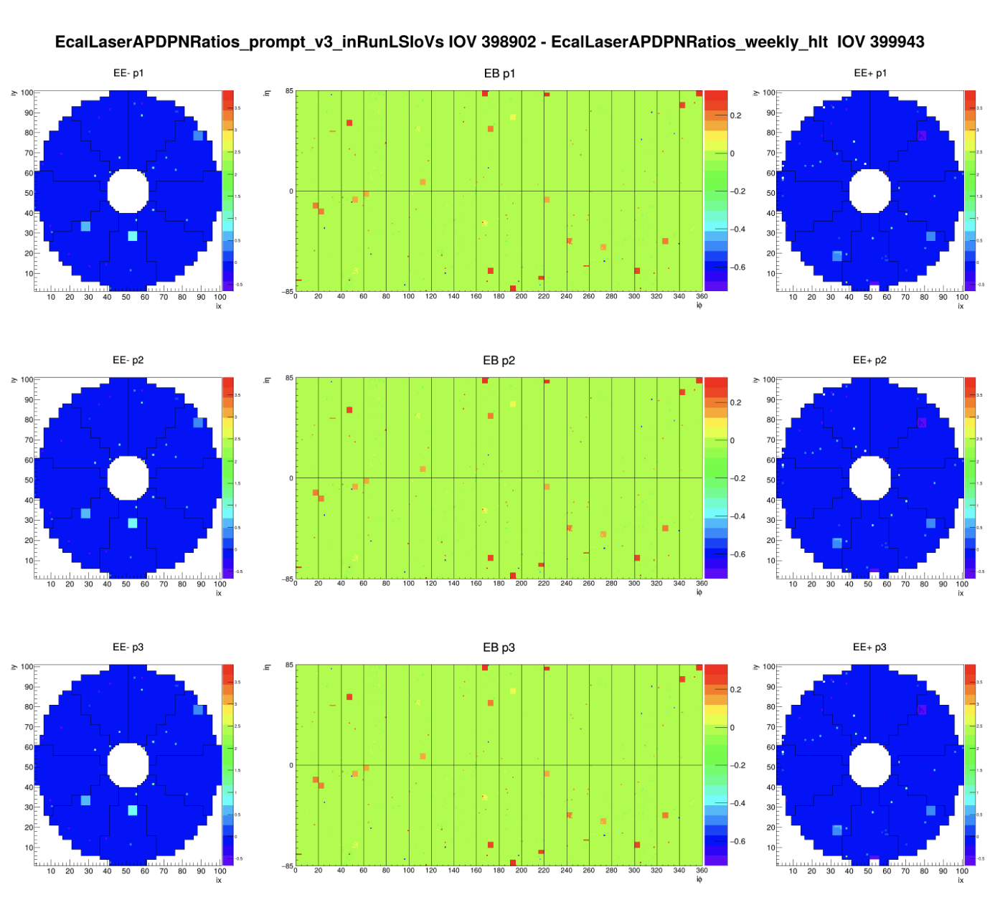
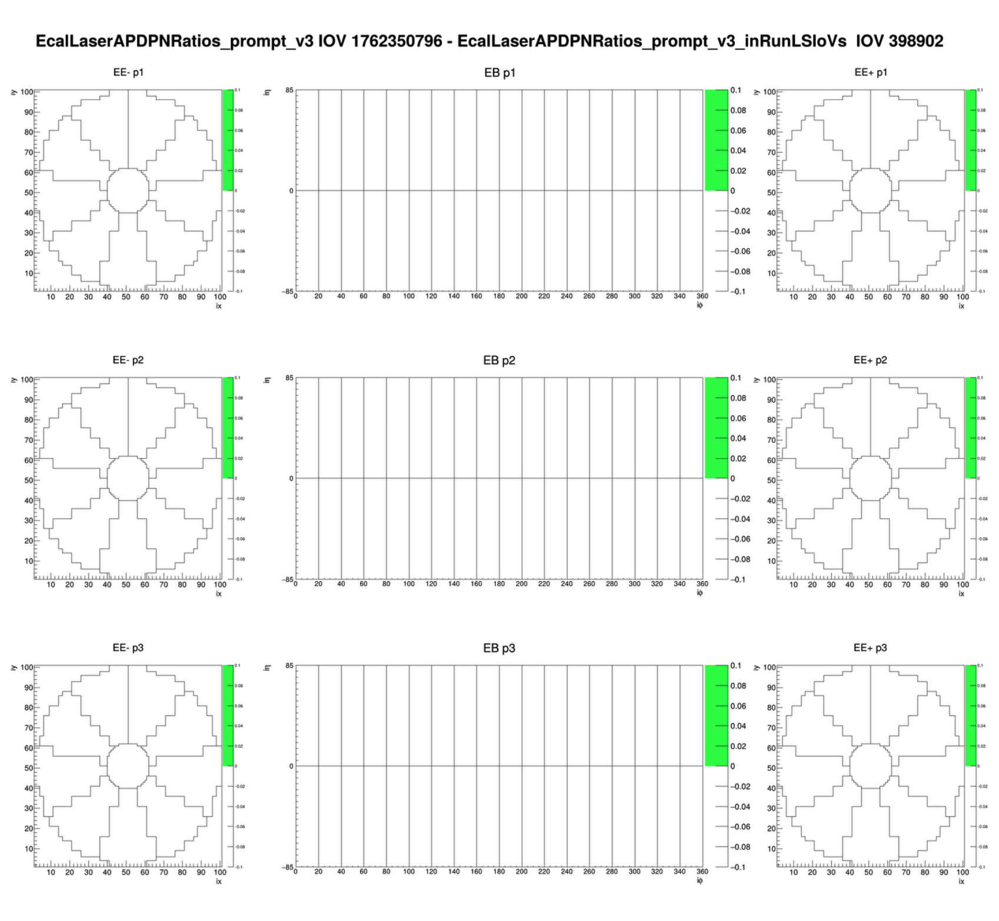
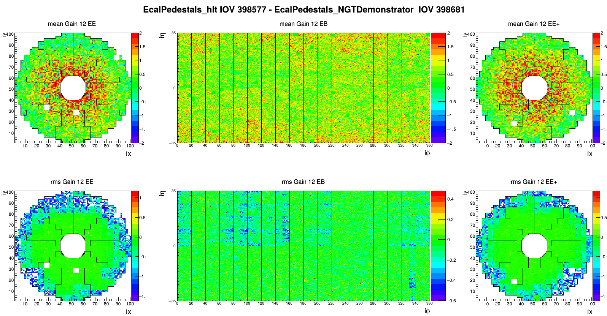
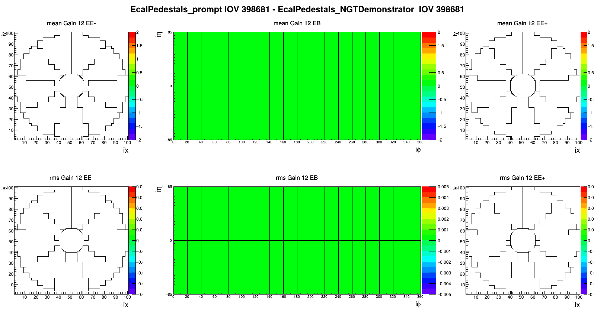

# ECAL Conditions

This directory contains comparisons of the ECAL laser corrections and ECAL
pedestals between the NGT, HLT, and Prompt conditions.

## ECAL laser corrections

The laser-correction plots were created with the
[CondDB Payload Inspector](https://cms-conddb.cern.ch/cmsDbBrowser/index/Prod).
Open [`EcalLaserAPDPNRatios`](https://cms-conddb.cern.ch/cmsDbBrowser/payload_inspector/Prod#collapse30),
select `plot_EcalLaserAPDPNRatiosDiffTwoTags`, and select the two tags to be
compared.

## ECAL pedestals

The pedestal comparison requires an extension to the ECAL Payload Inspector.
Start from the `src` directory of a CMSSW release and set up the package and
remote:

```bash
git cms-addpkg CondCore/EcalPlugins
git remote add ngt git@github.com:sakura-ngt/cmssw.git
git fetch ngt
git cherry-pick d079bb085b415532b3bdac6e077006ad89fdb36d
scram b -j
```

The cherry-picked change is also available for inspection in
[`mm_EcalPeds_ForDPNote`](https://github.com/cms-sw/cmssw/compare/master...sakura-ngt:cmssw:mm_EcalPeds_ForDPNote).

After the build finishes, create the NGT–HLT comparison with:

```bash
getPayloadData.py \
  --plugin pluginEcalPedestals_PayloadInspector \
  --plot plot_EcalPedestalsDiffTwoTags \
  --tag EcalPedestals_NGTDemonstrator \
  --input_params "{}" \
  --tagtwo EcalPedestals_hlt \
  --time_type Run \
  --iovs '{"start_iov": "398681", "end_iov": "398681"}' \
  --iovstwo '{"start_iov": "398577", "end_iov": "398577"}' \
  --db Prod \
  --test
```

Create the NGT–Prompt comparison with:

```bash
getPayloadData.py \
  --plugin pluginEcalPedestals_PayloadInspector \
  --plot plot_EcalPedestalsDiffTwoTags \
  --tag EcalPedestals_NGTDemonstrator \
  --input_params "{}" \
  --tagtwo EcalPedestals_prompt \
  --time_type Run \
  --iovs '{"start_iov": "398681", "end_iov": "398681"}' \
  --iovstwo '{"start_iov": "398681", "end_iov": "398681"}' \
  --db Prod \
  --test
```

`getPayloadData.py` prints the generated PNG filename when it completes. The
UUID-based pedestal filenames in `plots/` originate from those generated
outputs.

## Plots

| Comparison | Plot |
| :--- | :--- |
| Laser corrections: NGT–HLT |  |
| Laser corrections: NGT–Prompt |  |
| Pedestals: NGT–HLT |  |
| Pedestals: NGT–Prompt |  |
