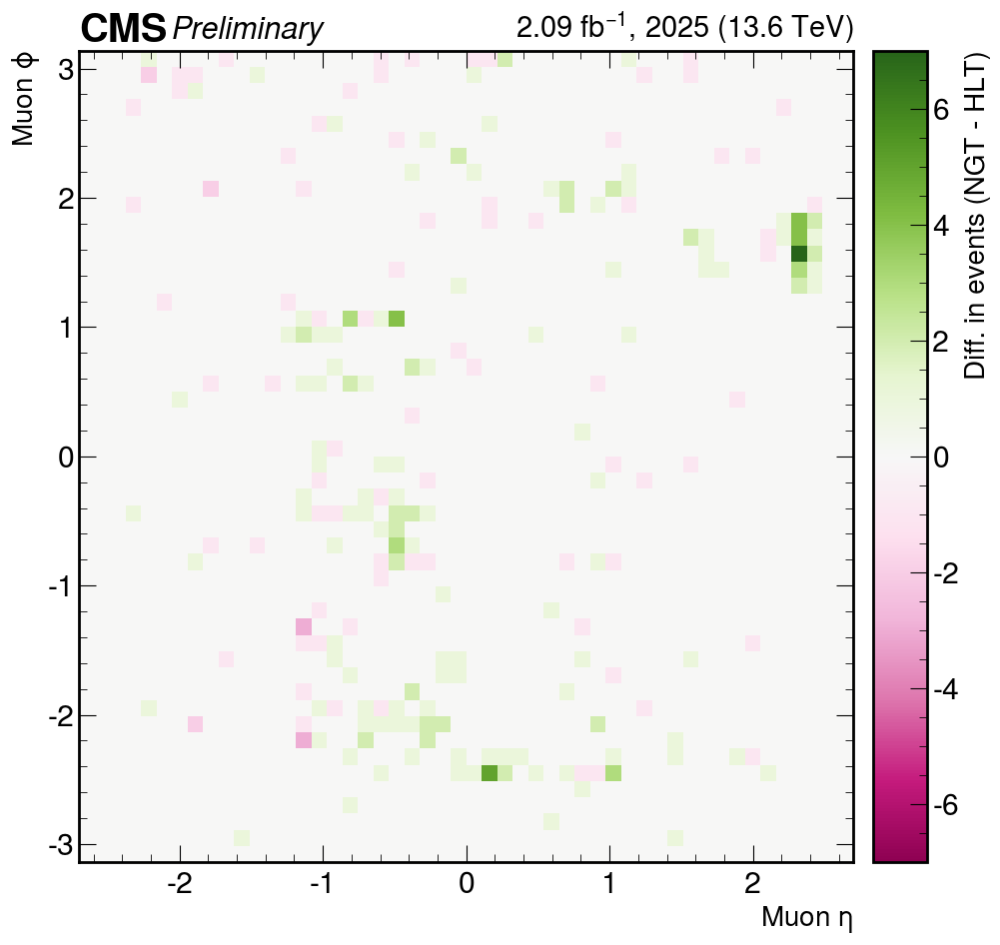
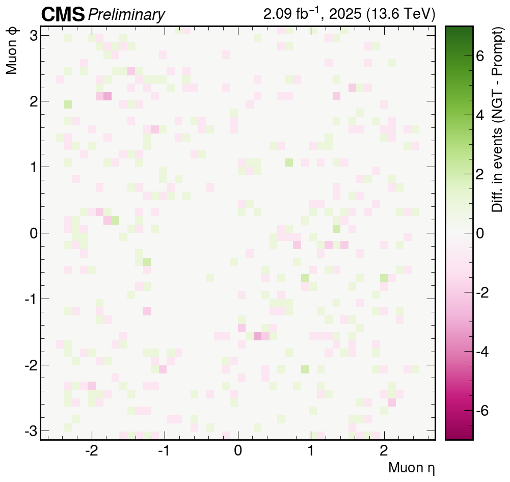

# HLT Muons

## Dataset

The DQM ROOT files used to produce these plots can be found in:

```text
/eos/cms/store/group/tsg-phase2/user/jprendi/NERD25/MoreStats/Muons/DQMs_Feb4th
```

The script looks for files matching `*NGT.root`, `*HLT.root`, and
`*Prompt.root` in the directory from which it is run. Please copy or link the
input files there, or adjust the patterns in `eta_phi_diffs.py` accordingly.

The DQM files must be produced with the HLT process and muon-filter
configuration documented in [Muon/getDQM](../../getDQM/README.md). In
particular, both PDG IDs `13` and `-13` must be configured for
`hltL3crIsoL1sSingleMu22L1f0L2f10QL3f24QL3trkIsoFiltered`; the plotting script
combines the resulting positive- and negative-muon histograms.

## Requirements

Use the same Python environment described in the
[HLT Scouting Muons requirements](../HLTScoutingMuons/README.md#requirements).

## Plots and Scripts

| Plot | Python Script |
| :--- | :--- |
|  | `eta_phi_diffs.py` |
|  | `eta_phi_diffs.py` |
