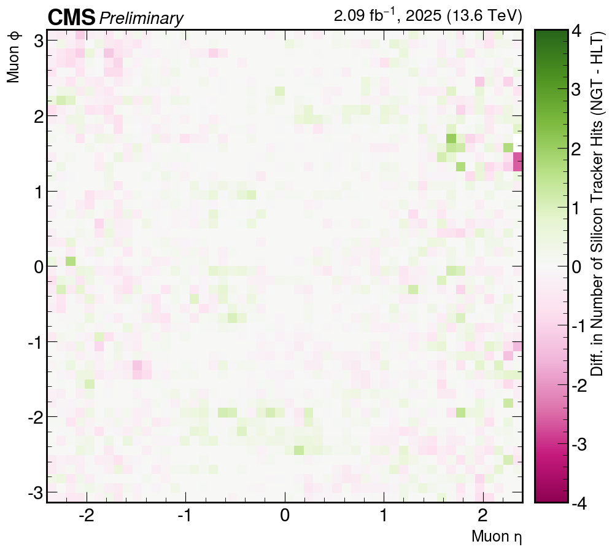
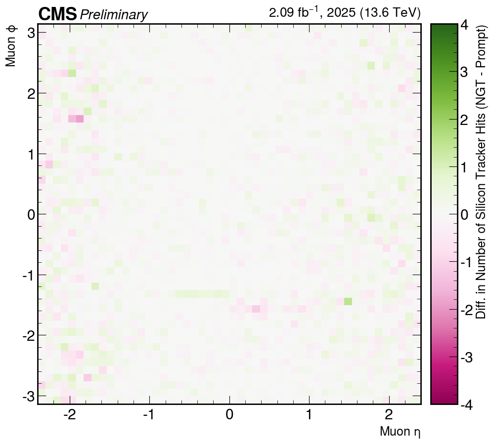

# HLT Scouting Muons

## Dataset

The script uses the Scouting DQM files for run `398858` from the Prompt, HLT,
and NGT workflows. It expects the following directory structure relative to
the directory from which it is run:

```text
Prompt/DQM_V0001_ScoutingDQM_R000398858.root
HLT/DQM_V0001_ScoutingDQM_R000398858.root
NGT/DQM_V0001_ScoutingDQM_R000398858.root
```

Please create this structure locally or adjust the paths in
`muon_cms_comparison.py`. The corresponding muon workflow outputs are stored
under:

```text
/eos/cms/store/group/tsg-phase2/user/jprendi/NERD25/MoreStats/Muons/DQM_090526
```

## Requirements

The plots were created locally using Python in a virtual environment. Install
the package versions listed in `requirements.txt` with:

```bash
pip install -r requirements.txt
```

or:

```bash
conda install --file requirements.txt
```

Using a dedicated virtual environment is recommended.

The script writes its output to `muon_cms_plots/`. The approved combined PNGs
are collected in the `plots/` directory shown below.

## Plots and Scripts

| Plot | Python Script |
| :--- | :--- |
|  | `muon_cms_comparison.py` |
|  | `muon_cms_comparison.py` |
