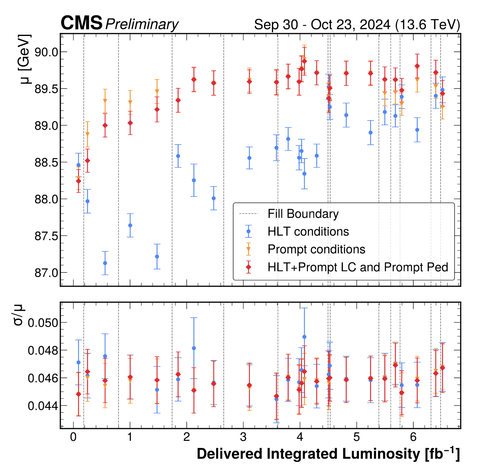
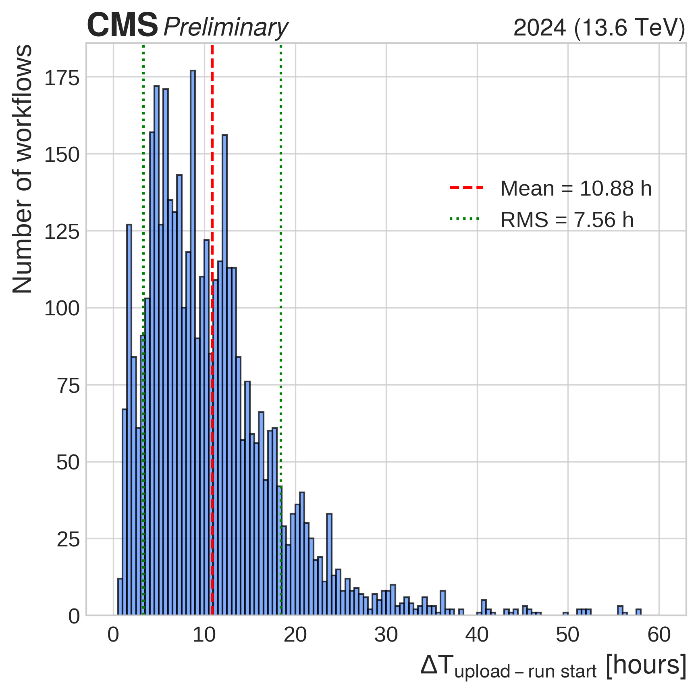
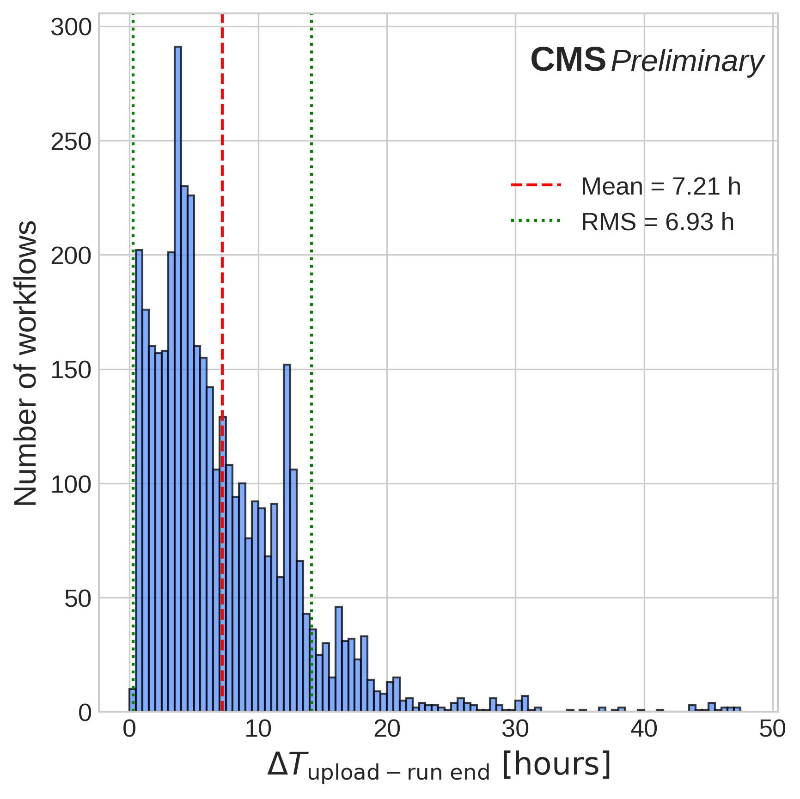
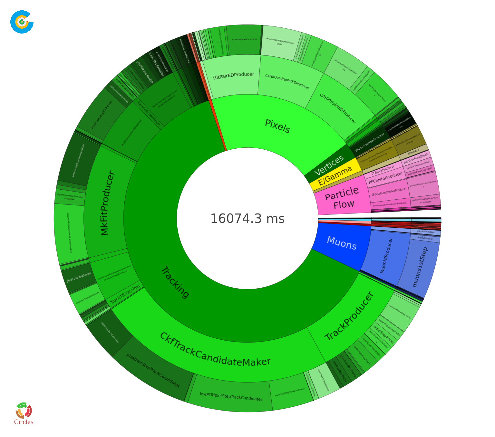
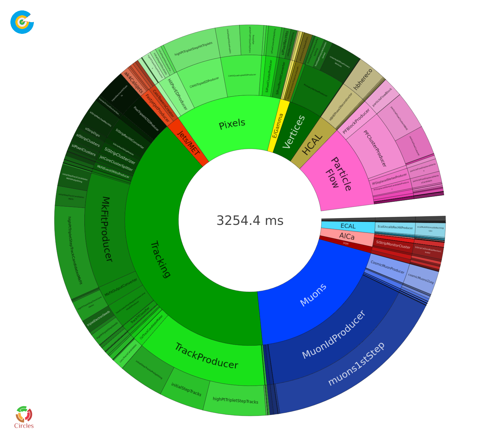
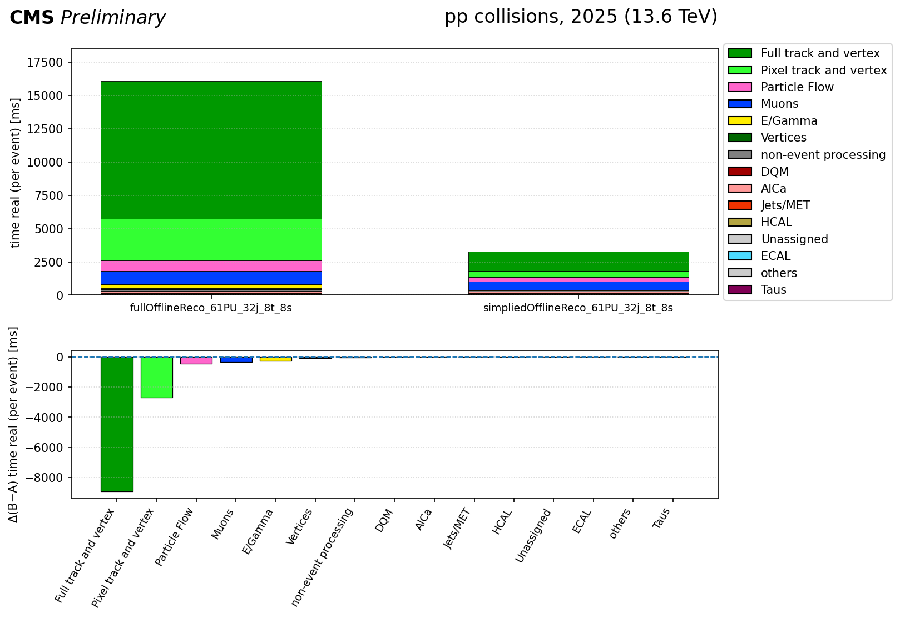
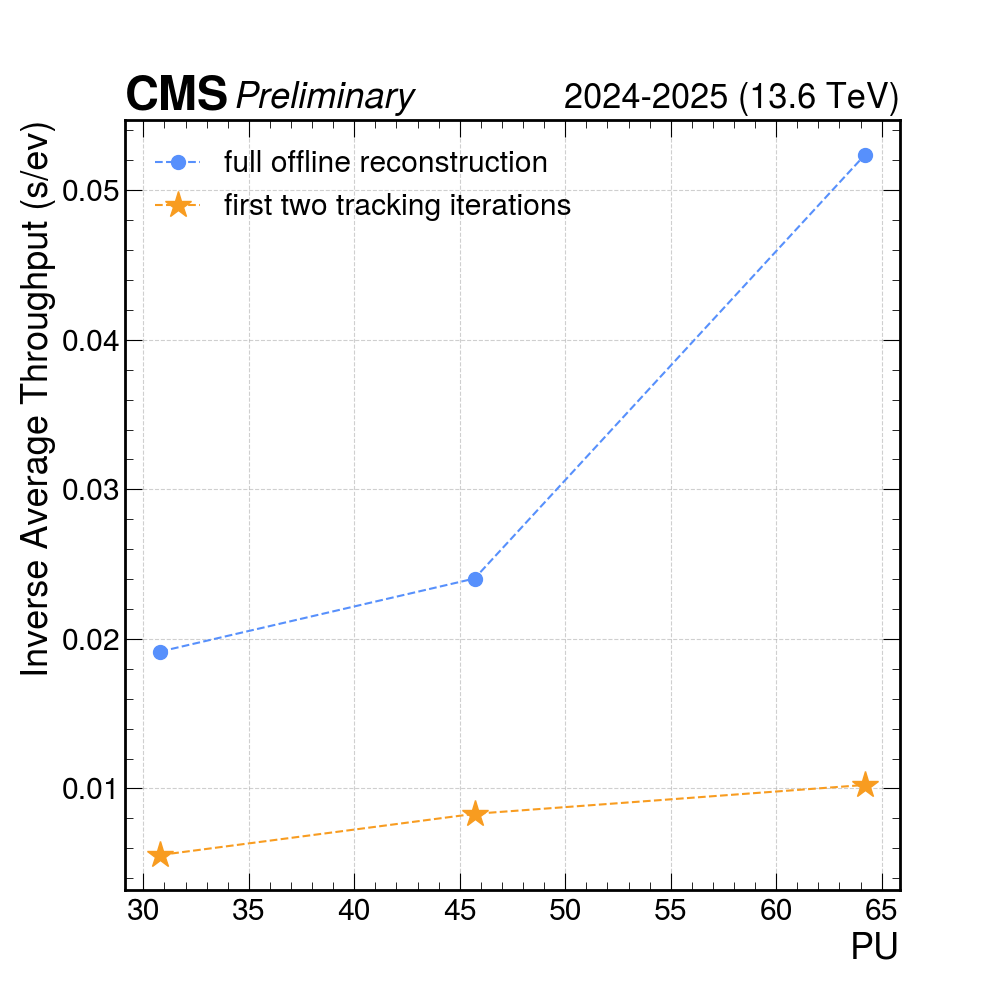

# Recipe on approved plots
## Overivew
This directory should include an overview of all the DP notes and detailed recipes on how the approved plots were obtained.

Here a list of DP notes:
- [CMS-DP-2025/082](https://twiki.cern.ch/twiki/bin/view/CMSPublic/DP2025082)

## Plots for which recipes exist
### Time Variation of Calibrations on Z-Peak fit 

This plot is included in [CMS-DP-2025/082](https://twiki.cern.ch/twiki/bin/view/CMSPublic/DP2025082) and the recipes are in `./dCal_dt-ECAL`.

### Absolute timing for the Prompt Calibration Loop

These plots are included in [CMS-DP-2025/XXX]() and recipes are in `./PCLTiming`

### Difference in reconstruction timing for different reconstruction options

### Scaling of inverse average throughput with respect to Pile Up

These plots are included in [CMS-DP-2025/XXX]() and recipes are in `./ScalingPU`
