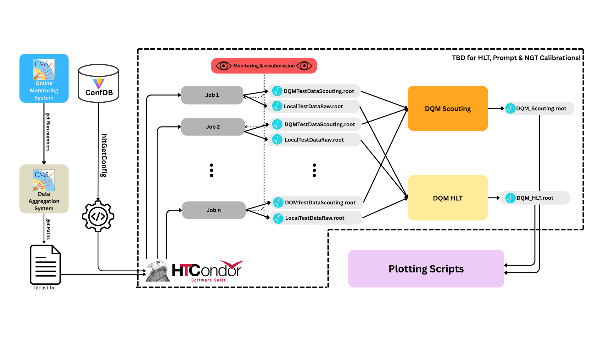

# NGT offline Evaluation Pipeline

This pipeline evaluates the performance of the NGT demonstrator: produce HLT
outputs for each calibration tag, check the batch jobs, run DQM, and compare the
harvested scouting histograms.



## Getting started

Run the production and DQM steps in a CMS environment with CMSSW, access to the
mounted EOS filesystem, and HTCondor for production jobs. The release used here
is **CMSSW_16_0_9**:

```bash
git clone git@github.com:cms-ngt-hlt/sakura.git
cd sakura/NERDAnalysis2026/AnalysisPipeline_ms/max_internship/
cmsrel CMSSW_16_0_9
cd CMSSW_16_0_9/src/
cmsenv
cd ../../
voms-proxy-init --voms cms -rfc --valid 168:00
cp "/tmp/x509up_u$(id -u)" .
module load lxbatch/eossubmit
```

Before running, edit [pipeline.cfg](pipeline.cfg). Its checked-in paths and
dataset pattern are blank placeholders:

| Setting | What to configure |
| --- | --- |
| `CMSSW_SRC` | Absolute path to the CMSSW release's `src` directory, accessible to workers. |
| `EOS_BASE` | Mounted EOS output directory for production; DQM reads `<EOS_BASE>/<tag>/run_<run>/`. |
| `EOS_XRD` | XRootD endpoint for production stage-out, matching your EOS location. |
| `DATASET_PATTERN` | Dataset regular expression for `generate_filelists.sh`; inspect the generated list before submission. |
| `FILELIST` | Raw-data input list. Generate it or deliberately reuse an existing list. |
| `RUNS`, `TAGS`, `GTAGS` | Runs and calibration tags to process; `TAGS` and `GTAGS` are parallel arrays in the same order. |
| `DQM_DEST_BASE` | Destination for final DQM histograms. |
| `DQM_CONFIGS` | Enabled recipes; currently both `dqm/scouting.sh` and `dqm/hlt.sh`. Use only `dqm/scouting.sh` if you only need scouting. |
| `DQM_WORK_BASE`, `DQM_THREADS` | Attempt directories (default `DQM_work`) and DQM processing threads (default 24). |

Keep `PROXY` consistent with the copied proxy filename. Check that the selected
streams, menu, era, and batch resources suit your production. For NGT,
`oms_runs.csv` must contain a snapshot time for every input run.

Run the commands below from this pipeline directory unless stated otherwise.

## Preparation and submission

### Combined preparation

```bash
bash 00_run_pipeline.sh
```

This regenerates `FILELIST` and `configs/hltDataDump.py` in parallel, then creates
jobs and submission files for every tag. It **does not submit** them. Review the
files and submit each tag, for example:

```bash
condor_submit condor_HLT.sub
condor_submit condor_Prompt.sub
condor_submit condor_NGT.sub
```

To prepare and submit in one invocation, use `bash 00_run_pipeline.sh --fulltrust`
instead. Both modes require the configuration above; automatic submission also
requires the proxy and `condor_submit` to be ready beforehand.

Existing `Jobs_<tag>` directories cause preparation to stop. `--force` deletes
and regenerates those directories, including local logs, but leaves EOS outputs
in place. Do not regenerate them while jobs or resubmissions still use them.

### Manual preparation

1. Activate CMSSW with `cmsenv` and generate the shared menu:

   ```bash
   bash 01_make_config.sh
   ```

   This writes `configs/hltDataDump.py`.

2. Generate the input list (or check that the existing `FILELIST` is the intended
   one), then prepare and submit each tag:

   ```bash
   bash generate_filelists.sh
   python3 02_submit.py --tag HLT
   condor_submit condor_HLT.sub
   ```

5.  Now you have all the event data that you need, next step is plotting. 
    If you want, you can run `python3 sanitiy_check_event_counter.py` first - this shows you the Z -> ee event counts for the different calibration tags. 
    The different plotting scripts are available in the `plotting` folder. They can be executed like simple python files: `python3 <script.py>`. 
    To compare *all* 1D histograms of the DQM files at once (instead of the hand-picked ones of the dedicated scripts), use `python3 all_1D_ScoutingDQM.py`; it supports `--include/--exclude` regex filters and `--list`, see [plotting/README.md](plotting/README.md). 

   Each tag has one `Jobs_<tag>/run_cfg.py`, frozen from the generated menu.
   Per-job scripts supply inputs and the NGT snapshot time through
   `HLT_JOB_OPTIONS`; workers copy the shared config to their temporary directory.
   Keep the job directories and shared configuration accessible and unchanged
   until jobs and resubmissions finish. Preparation with `02_submit.py` does not
   import CMSSW; menu generation and workers still require it.

## 3. Check production jobs

The plotting scripts need Python with `numpy`, `uproot`, `pyyaml`, `matplotlib`
and `mplhep`; they do not need CMSSW or PyROOT. On LXPLUS, connect with
`ssh YOUR_CERN_USERNAME@lxplus.cern.ch` and use a fresh shell without `cmsenv`
so that CMS packages do not leak into the plotting environment.

Run this once on the machine where you will plot (LXPLUS or your laptop):

```bash
mkdir -p "$HOME/venvs"
python3 -m venv "$HOME/venvs/scouting-plots"
source "$HOME/venvs/scouting-plots/bin/activate"
python -m pip install --upgrade pip
python -m pip install numpy uproot pyyaml matplotlib mplhep
```

For each new terminal, activate the environment again with
`source "$HOME/venvs/scouting-plots/bin/activate"`. Both `which python` and
`python -m pip --version` should point inside that environment.

**On LXPLUS, using pipeline output:** set `DQM_DEST_BASE` in `pipeline.cfg`
to your DQM output base. With the default plotting config, inputs are
`$DQM_DEST_BASE/scouting/{Prompt,HLT,NGT}/*.root` (or directly under the base
when there is no `scouting/` directory). From this pipeline directory:

```bash
cd plotting
python all_1D_ScoutingDQM.py --limit 5 --jobs 1
python all_1D_ScoutingDQM.py --jobs 1 --no-png
```

Use `--jobs 1` on shared LXPLUS login nodes; the default uses all cores.

**Using local files:** put the ROOT files in `plotting/Prompt/`, `plotting/HLT/`
and `plotting/NGT/`, or set the condition paths in `plotting/config.yaml` to
their actual locations. From `plotting/`, run:

```bash
python all_1D_ScoutingDQM.py --local --limit 5 --jobs 1
python all_1D_ScoutingDQM.py --local --jobs 2 --no-png
```

`--local` skips reading or sourcing `pipeline.cfg` entirely. Relative condition
paths are resolved from the working directory, absolute paths are used directly,
and `--pipeline-cfg` is ignored. This mode also works on LXPLUS. Omit `--no-png`
to write PNGs in addition to PDFs.

See the [all-1D plotting guide](plotting/README.md) for
environment troubleshooting, input layouts and the full list of options.

## Further Information
For more details, espeically on the curation of the file list and the software architecture of the plotting scripts, see the [report](docs/report.pdf)
>>>>>>> fc458db (Add local input mode and document plotting setup)

Monitor jobs with `condor_q`. Once they have finished, run this for each tag:

```bash
python3 03_check.py --tag NGT
```

It produces `check_report_NGT.md`, `resubmit_NGT.txt`, and
`condor_resubmit_NGT.sub`. Read the report and, if failures are listed, run:

```bash
condor_submit condor_resubmit_NGT.sub
```

Repeat after the resubmitted jobs finish. Reports made while jobs are active are
provisional. `PENDING` jobs are not automatically resubmitted; check whether they
are running or still need their original submission. Resolve missing outputs
before DQM: step 4 discovers files on disk and does not check the production
manifest for completeness.

## 4. Run DQM

To add a DQM workflow, place its Bash script in the `dqm/` folder and add its
path to `DQM_CONFIGS` in `pipeline.cfg` (for example, `"dqm/my_dqm.sh"`). Use
`dqm/scouting.sh` as a reference: the script receives its parameters from the
wrapper and must leave its final histogram output as `result.root` in its working
directory. See [DQM script instructions](dqm/README.md) for the available parameters.

With `cmsenv` active, `EOS_BASE` and `DQM_DEST_BASE` configured, and production
outputs available:

```bash
# All enabled recipes for one run and calibration tag:
bash 04_run_dqm.sh --tag NGT --run 403863

# All enabled recipes, tags, and runs:
bash 04_run_dqm.sh
```

The checked-in configuration enables **scouting and HLT**, in that order. Both
require CMSSW. Scouting runs multithreaded `cmsDriver.py` DQM and then harvesting;
HLT runs `DQM:onlinehlt4vector` and then harvesting.

Local execution is sequential: recipe → tag → run. Choose recipes in `DQM_CONFIGS` in
`pipeline.cfg`; every listed recipe runs. `--tag` and `--run` select configured entries;
omitting a filter processes all entries for that loop. The first failure stops
the wrapper. Each invocation retains its recipe, input list, configs, and logs
in `DQM_WORK_BASE/<workflow>/<tag>/run_<run>/attempt_*/`.

### Submit DQM to HTCondor

```bash
# Prepare one job per workflow × tag × run, without submitting:
bash 04_run_dqm.sh --prepare
# Or prepare and submit in one command:
bash 04_run_dqm.sh --submit
# Submit just one combination (also useful for retries):
bash 04_run_dqm.sh --submit --workflow scouting --tag NGT --run 403863
```

The default configuration creates **13 × 3 × 2 = 78 jobs**. Adding recipes to
`DQM_CONFIGS` automatically adds jobs. All three filters also work locally.
`--prepare` prints the `condor_submit` command for its generated submission file.
Each invocation creates a fresh `DQM_WORK_BASE/batch_*/` with a manifest and
`job_<index>/` directories containing frozen recipes and job scripts with their settings and output
publication commands. Later config/recipe edits do not change those jobs. Workers initialize
CMSSW using `scramv1 runtime -sh` in `CMSSW_SRC` (or the active release's `src`
when that setting is blank).

Batch execution uses a **shared filesystem**: workers must be able to read the
CMSSW release and configured `PROXY`, read mounted `EOS_BASE`, and write
`DQM_WORK_BASE` and `DQM_DEST_BASE`. Keep these paths available until jobs finish;
this mode does not transfer inputs or ship CMSSW. Prepare on the CERN submission
host with the same EOS access used for local DQM. Each job requests `DQM_THREADS`
CPUs, `DQM_REQUEST_MEMORY_MB` MB of memory, and `DQM_JOB_FLAVOUR` runtime. The
latter two default to the HLT batch settings; adjust them for your DQM workload.

Monitor with `condor_q`; each job retains `dqm.stdout`, `dqm.stderr`,
`dqm.condor.log` (scheduler events), and recipe logs. Successful publication prints
`DQM_JOB_DONE_OK`. Failed jobs exit nonzero and retain their working files.
Use the manifest to identify failed combinations and submit them again with the
filters above. `03_check.py` checks HLT production only. Avoid overlapping
submissions for the same combination: successful jobs replace the same output.

Final histograms are published as, for example:

```text
<DQM_DEST_BASE>/scouting/NGT/DQM_scouting_R000403863.root
<DQM_DEST_BASE>/hlt/NGT/DQM_hlt_R000403863.root
```

A successful rerun replaces that workflow/tag/run's published file; existing
results are not skipped. See [DQM instructions](dqm/README.md) for conditions,
input patterns, troubleshooting, and adding recipes.

## 5. Plot scouting results

Set each `conditions[].path` in [plotting/config.yaml](plotting/config.yaml) to
the corresponding **scouting** result directory, preferably as an absolute path:
`<DQM_DEST_BASE>/scouting/Prompt`, `<DQM_DEST_BASE>/scouting/HLT`, and
`<DQM_DEST_BASE>/scouting/NGT`. These paths are not read from `pipeline.cfg`.
Review the luminosity, year, and histogram prefix in that YAML as well.

The plotting environment needs `numpy`, `uproot`, `PyYAML`, `matplotlib`, and
`mplhep`. Run the entry scripts from `plotting/`, because they load `config.yaml`
from the current working directory:

```bash
cd plotting
python3 invariantMass_ScoutingDielectron.py
```

The other plot entry scripts run the same way; `scouting_plot.py` is the shared
framework. PDFs are written in the working directory and PNGs under the configured
`output.png_dir`. Each condition aggregates all `*.root` files in its directory,
so use matching run coverage across the compared tags.

The optional `sanitiy_check_event_counter.py` still expects `HLT/`, `NGT/`, and
`Prompt/` directories next to itself. To use it with the new layout, provide
those directories as links to the scouting result directories (or copy the
results there). It does not use `plotting/config.yaml` or `DQM_DEST_BASE`.

## Further information

See the [report](docs/report.pdf) for background on file-list curation and the
plotting architecture. For current DQM commands and output layout, use the
[DQM README](dqm/README.md).
