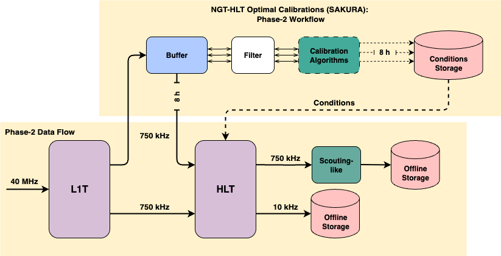
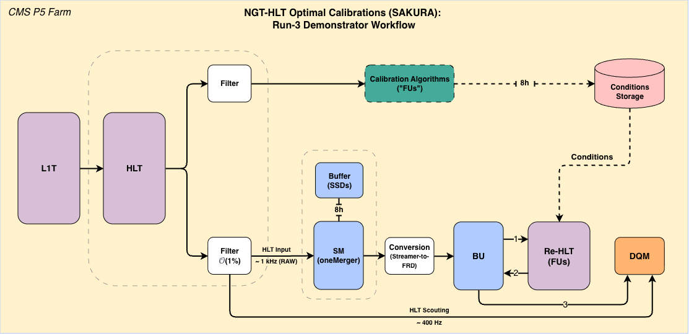

# SAKURA 🌸 

Repository for Task 3.4 of the CMS-NGT-HLT project (**S**peedy **A**lignment & **C**alibration **U**pgrade for **R**eal-time **A**lgorithms)

## Schematics of the project

## Schematics for the Run-3 demonstrator

