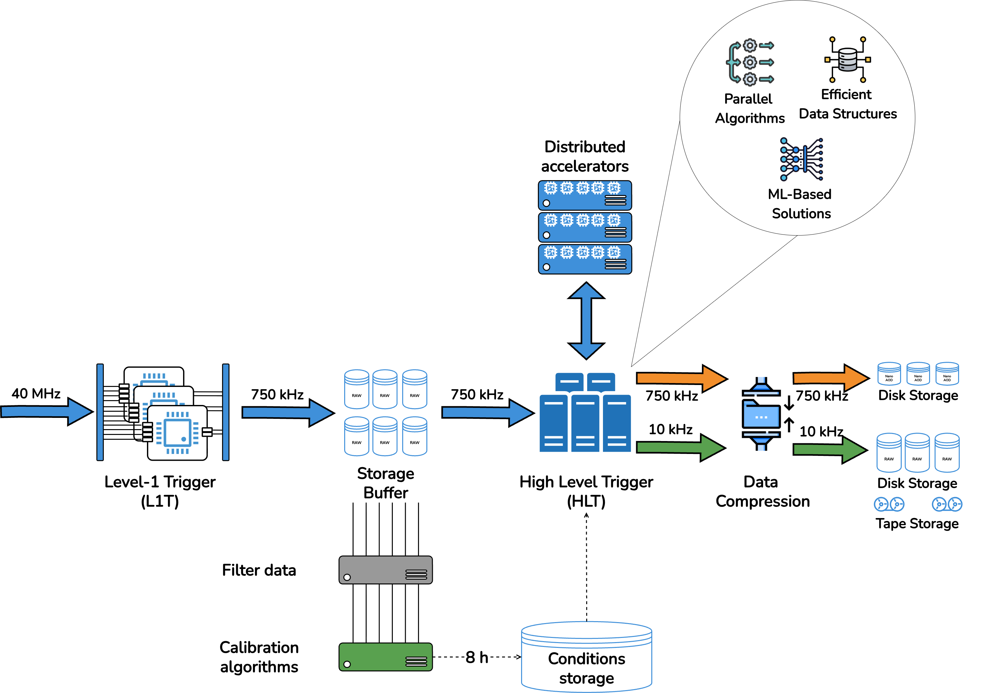
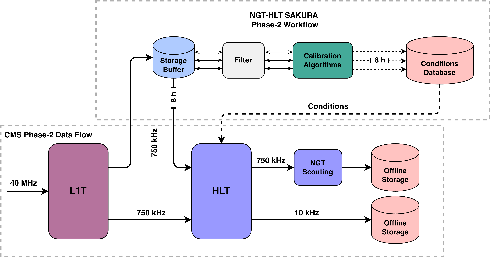
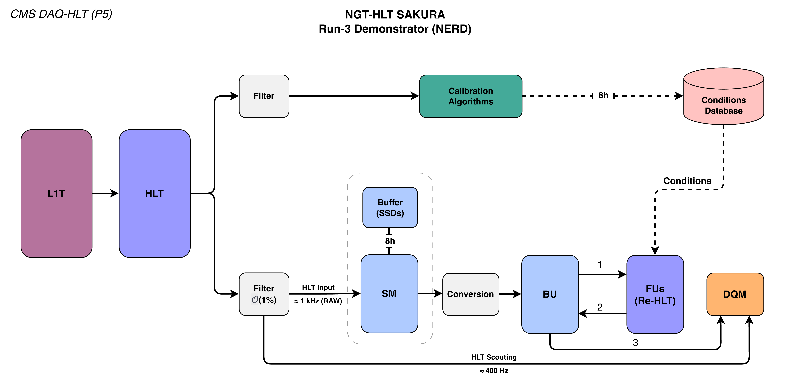
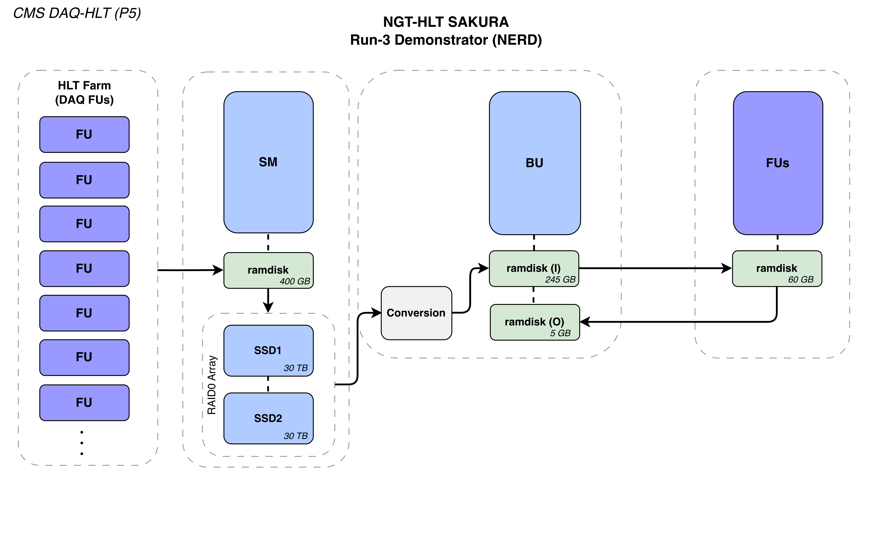

# SAKURA 🌸 

Repository for Task 3.4 of the CMS-NGT-HLT project (**S**peedy **A**lignment & **C**alibration **U**pgrade for **R**eal-time **A**lgorithms)

## Conceptual Design for Phase 2

NGT Scouting concept for Phase 2, underlining all the NGT-HLT ($R^3$) tasks:

Conceptual design of the NGT Optimal Calibrations Workflow:

## NGT Optimal Calibrations Demonstrator (Run 3) Workflow

Detailed data-flow (between SSDs and ramdisks) of the NGT demonstrator:

