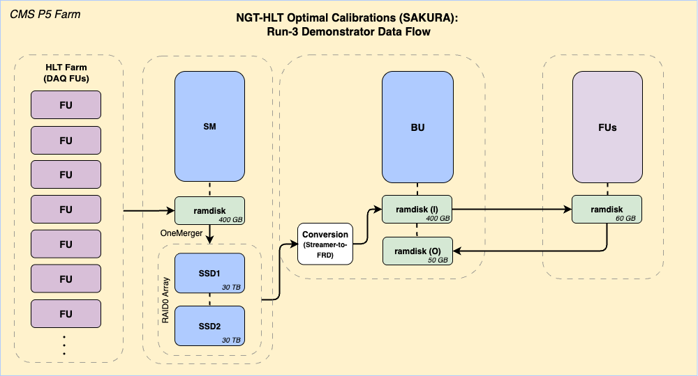

# SAKURA 🌸 

Repository for Task 3.4 of the CMS-NGT-HLT project (**S**peedy **A**lignment & **C**alibration **U**pgrade for **R**eal-time **A**lgorithms)

## NGT Optimal Calibrations Workflow (Conceptual Design for Phase 2)

## NGT Optimal Calibrations Demonstrator (Run 3) Workflow

Detailed data-flow (between SSDs and ramdisks) of the NGT demonstrator:

